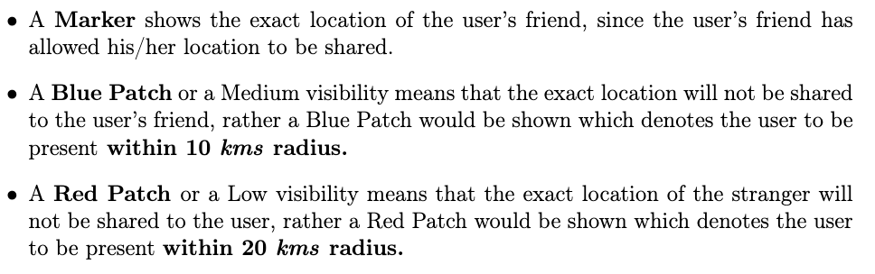
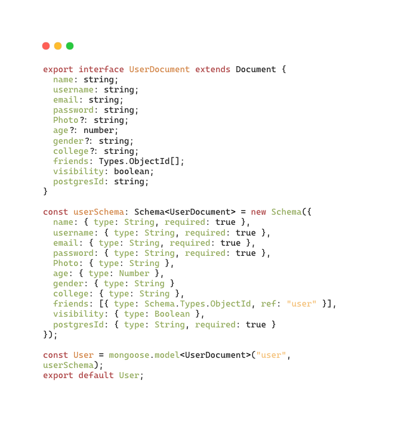
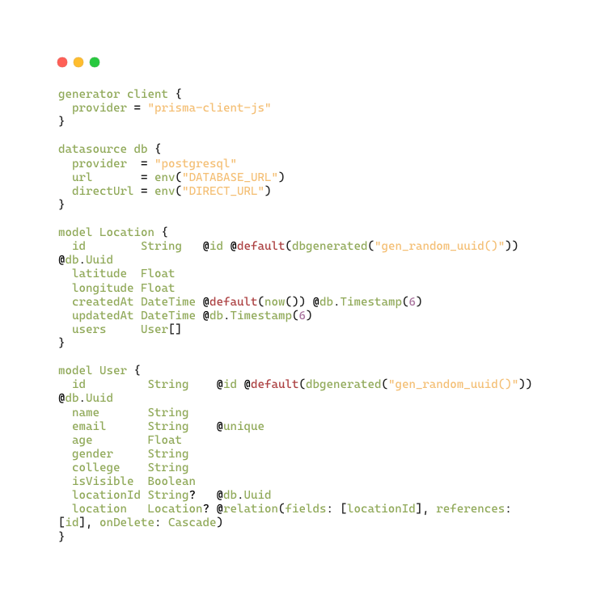

# Privacy Network

<i> Design and Implementation of Security-Conscious,
Location-Sharing in a Geosocial Network </i>

[Link to the presentation](papers/Panel_2_Team16_PrivacyNetwork.pptx)

[Link to the reference research paper](https://ieeexplore.ieee.org/abstract/document/9288801)

## Architecture

### One Instance Architecture


### Managing the MongoDB and Postgres


### Scalable Architecture


<!--  -->

## Privacy Filtration Logic





## Database Schema

### Mongoose Schema



### ERD


### Prisma Schema



## PostGIS Query

```sql
CREATE OR REPLACE FUNCTION nearby_privacy_entities(
    IN lat FLOAT,
    IN long FLOAT,
    IN d FLOAT,
    IN max_age FLOAT,
    IN college_param TEXT,
    IN gender_param TEXT,
    IN entity_type TEXT
)
RETURNS TABLE (
    id TEXT,
    name TEXT,
    email TEXT,
    age FLOAT,
    gender TEXT,
    college TEXT,
    isVisible BOOLEAN,
    lat FLOAT,
    long FLOAT,
    dist_meters FLOAT
)
LANGUAGE SQL
AS $$
    SELECT
        entity.id,
        entity.name,
        entity.email,
        entity.age,
        entity.gender,
        entity.college,
        entity."isVisible",
        latitude AS lat,
        longitude AS long,
        ST_DISTANCE(
            ST_GeomFromText('POINT(' || long || ' ' || lat || ')', 4326)::geography,
            ST_SetSRID(ST_MakePoint(longitude, latitude), 4326)::geography
        ) AS dist_meters
    FROM
        "Location"
    JOIN
        "User" entity ON "Location".id = entity."locationId"
    WHERE
        ST_DISTANCE(
            ST_GeomFromText('POINT(' || long || ' ' || lat || ')', 4326)::geography,
            ST_SetSRID(ST_MakePoint(longitude, latitude), 4326)::geography
        ) <= d AND entity_type = 'user'
        AND (college_param IS NULL OR entity.college = college_param)
        AND (gender_param IS NULL OR entity.gender = gender_param)
        AND (max_age IS NULL OR entity.age <= max_age)
    ORDER BY
        ST_SetSRID(ST_MakePoint(longitude, latitude), 4326)::geography <-> ST_GeomFromText('POINT(' || long || ' ' || lat || ')', 4326)::geography;
$$;
```

## Privacy Network API Documentation

_[Privacy Network API Docs](https://privacynetwork.onrender.com/docs)_

### OpenAPI Swagger API Docs

__

### OpenAPI Swagger Schemas

__

### Login Page


### Landing Page


### Map Page: Real-Time Location Updation

.gif>)

.gif>)

### Map Page: Privacy Filtration


### Map Page: Real-Time Location Sharing


## Tech Stack

- TypeScript
- React with _Google Maps API_ and _Material UI_
- Node
- Express
- WebSockets
- MongoDB
- Postgres with PostGIS
- Swagger

## Setting up locally

The codebase is organized as :

1. _ts-frontend_ - The react frontend
2. _backend/ts-backend_ - The primary express backend with mongoDB
3. _backend/loc_ - The secondary express backend with Postgres
4. _backend/ws_ - The websocket backend

- Clone the PrivacyNetwork repository

```bash
    git clone git@github.com:sanam2405/PrivacyNetwork.git
    cd PrivacyNetwork
```

- Configure the `.env` of the four servers

```bash
// ts-frontend

VITE_BACKEND_URI=<BACKEND_API_URI: ts-backend server address>
VITE_WS_URI=<WEBSOCKET_URI: ws WebSocket server address>
VITE_GOOGLE_API_KEY=<GOOGLE_MAPS_API_KEY: API KEY for Google map>
```

```bash
// ts-backend

GOOGLE_CLIENT=<GOOGLE_CLIENT_ID: for logging in with Google>
GOOGLE_API_KEY=<GOOGLE_API_KEY: for logging in with Google>
MONGO_URI=<MONGO_URI: for mongoDB database connection>
SECRET_KEY=<CLIENT_SECRET: for generating/verifying the JWT token>
PORT=<PORT: at which the ts-backend server runs>
LOCATION_BACKEND_URI=<LOCATION_BACKEND_URI: for location querying req to loc server>
BACKEND_INTERCOMMUNICATION_SECRET=<BACKEND_INTERCOMMUNICATION_SECRET: for backend intercommunication>
```

```bash
// loc

DATABASE_URL=<DATABASE_URI: for connecting to the Postgres instance of Supabase>
DIRECT_URL=<DIRECT_URL: for connection direct connection to Postgres instance of Supabase via ORM Prisma for migrations>
BACKEND_INTERCOMMUNICATION_SECRET=<BACKEND_INTERCOMMUNICATION_SECRET: for backend intercommunication>
```

```bash
// ws

SECRET_KEY=<CLIENT_SECRET: verifying the JWT token>
TS_BACKEND_URI=<TS_BACKEND_URI: for user auth from ts-backend>
```

- Database Seeding

```bash

// MongoDB Mock Data

backend/ts-backend/src/mockdata
└── MOCK_DATA.json

// Postgres Mock Data

backend/loc/src/mockdata
├── Location.sql
└── User.sql
```

- Run the frontend

```bash
    cd ts-frontend
    npm install
    npm run dev
```

- Run the MongoDB backend

```bash
    cd backend/ts-backend
    npm install
    npm run dev
```

- Run the Postgres backend

```bash
    cd backend/loc
    npm install
    npm run dev
```

- Run the WebSocket backend

```bash
    cd backend/ws
    npm install
    npm run build
    npm start
```

## Contributors

- `Manas Pratim Biswas` -
  [LinkedIn](https://www.linkedin.com/in/manas-pratim-biswas/)
- `Anumoy Nandy` -
  [LinkedIn](https://www.linkedin.com/in/anumoy-nandy-9b527b204/)
- `Kunal Pramanick` -
  [LinkedIn](https://www.linkedin.com/in/kunal-pramanick-9755061b0/)

## Mentor

- `Dr. Munmun Bhattacharya`
