# Privacy Network

<i> Design and Implementation of Security-Conscious,
Location-Sharing in a Geosocial Network </i>

[Link to the research paper](https://ieeexplore.ieee.org/abstract/document/9288801)

## Architecture

### One Instance Architecture

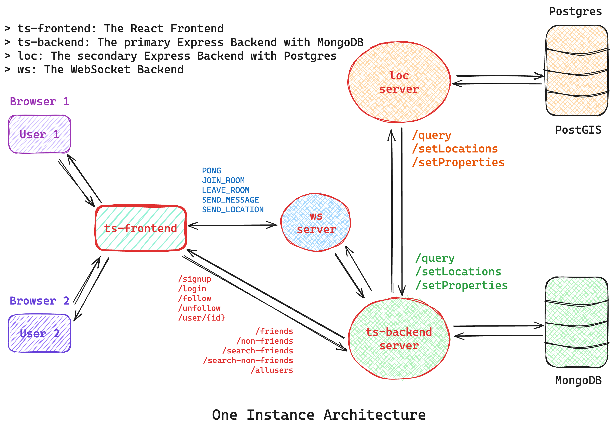

### Managing the MongoDB and Postgres

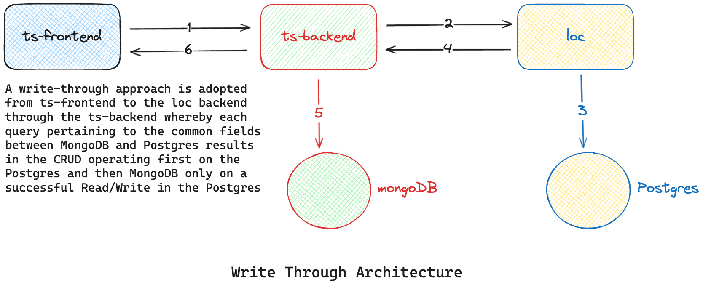

### Scalable Architecture

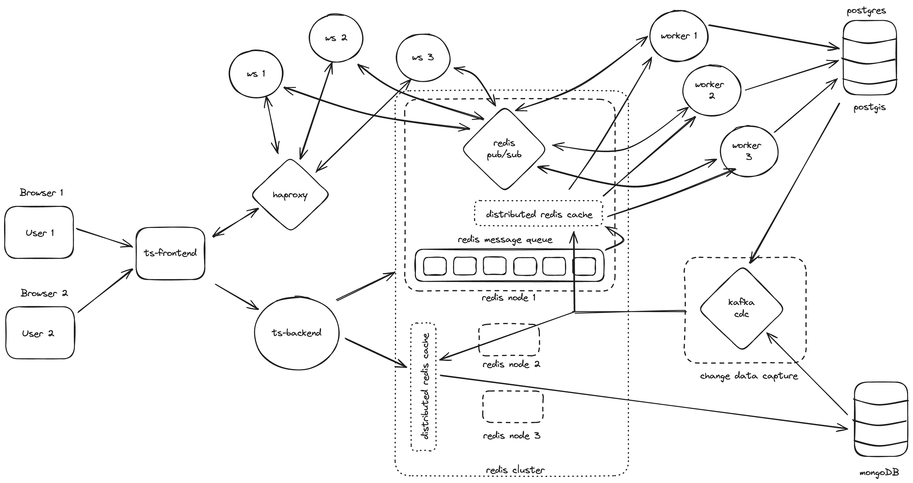

<!-- 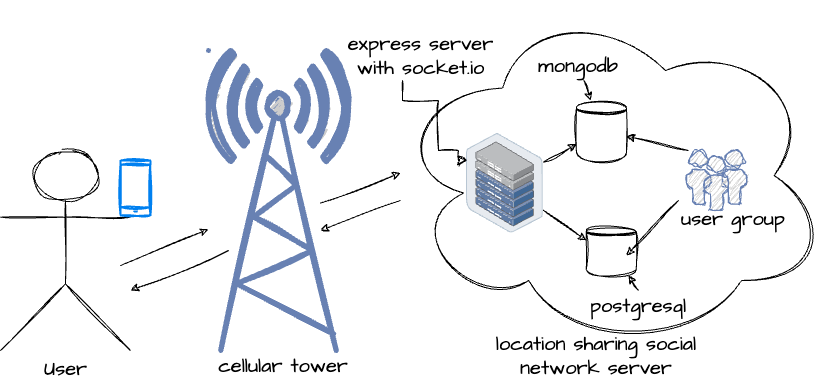 -->

## Privacy Filtration Logic

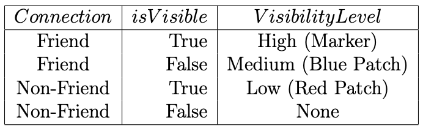

## Privacy Network API Documentation

_[Privacy Network API Docs](https://privacynetwork.onrender.com/docs)_

<!-- __ -->

### OpenAPI Swagger API Docs

_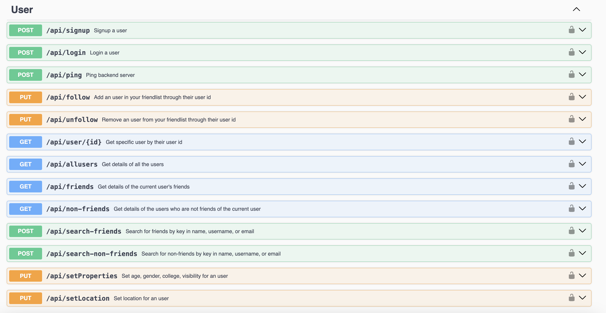_

### OpenAPI Swagger Schemas

_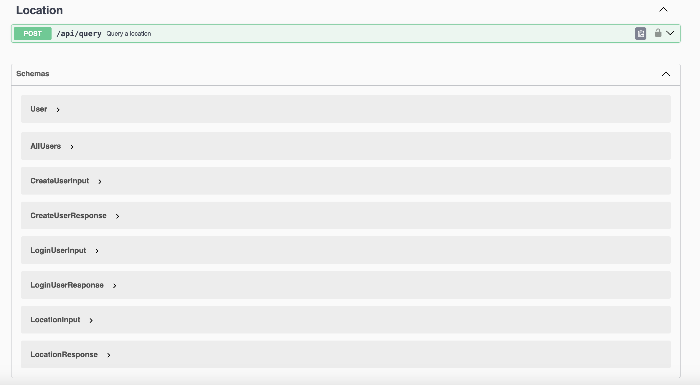_

<!--
### A. Registration - <i> User </i>

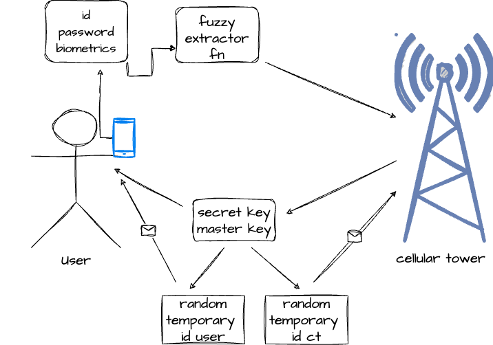

### B. Registration - <i> LSSNS </i>

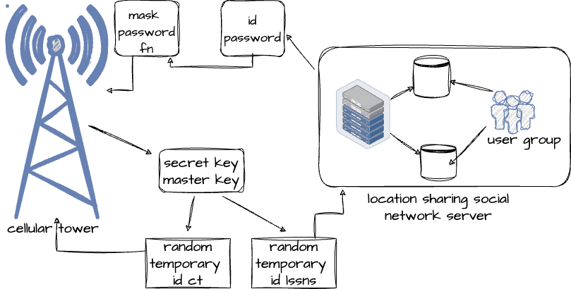

### C. <i> mSON </i> user login, authentication and key generation

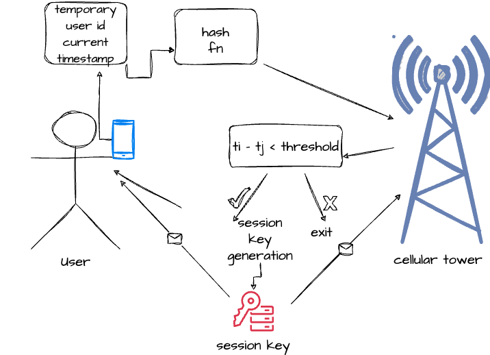

### D. <i> LSSNS </i> login, authentication and key generation

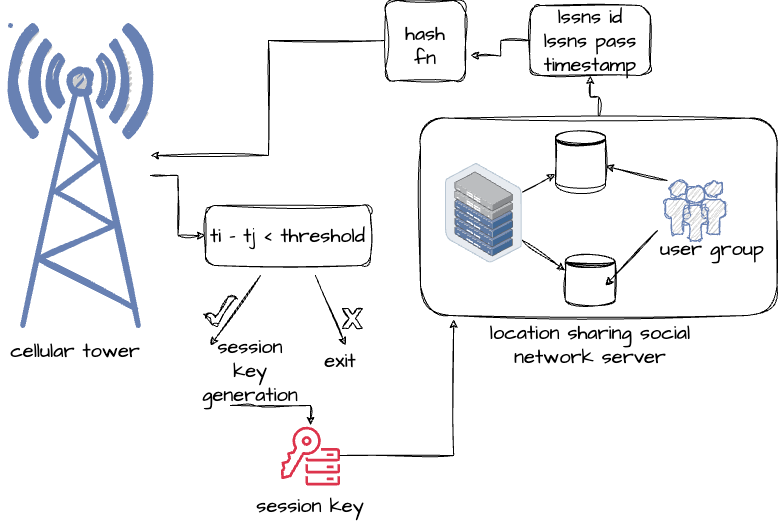

### E. Distance threshold registration

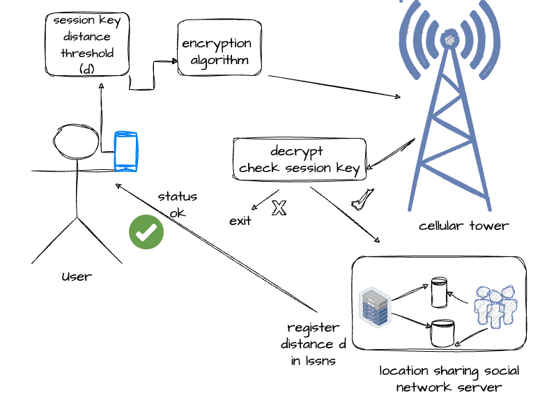

### F. User location update

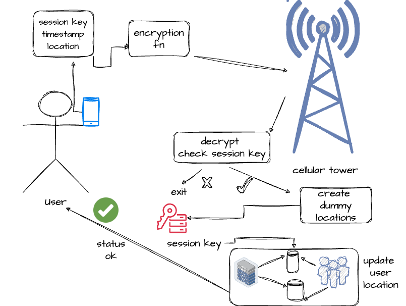

### G. Friend's location query

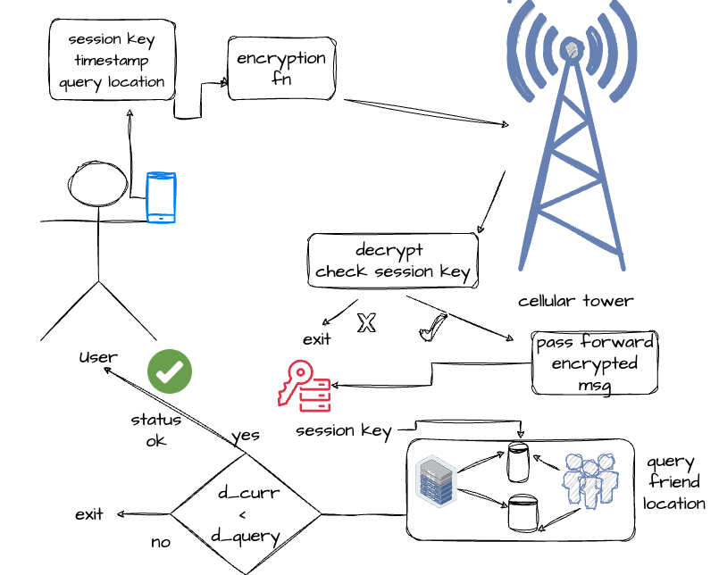 -->

### Login Page

<!-- 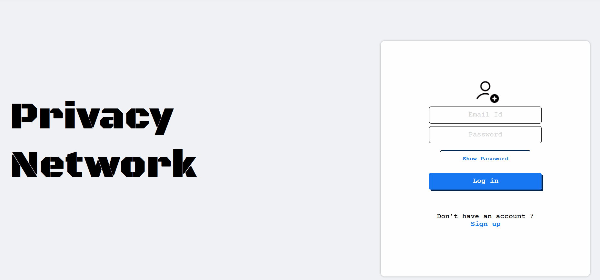 -->

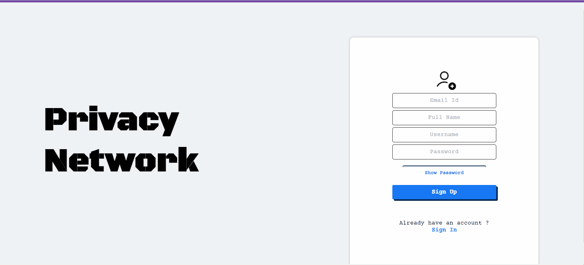

### Landing Page

<!-- 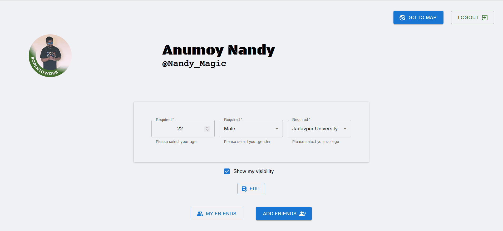 -->


<!--  -->

<!--  -->

### Map Page: Real-Time Location Updation

.gif>)

.gif>)

### Map Page: Privacy Filtration


### Map Page: Real-Time Location Sharing


## Tech Stack

- TypeScript
- React with _Google Maps API_ and _Material UI_
- Node
- Express
- WebSockets
- MongoDB
- Postgres with PostGIS
- Swagger

<!-- 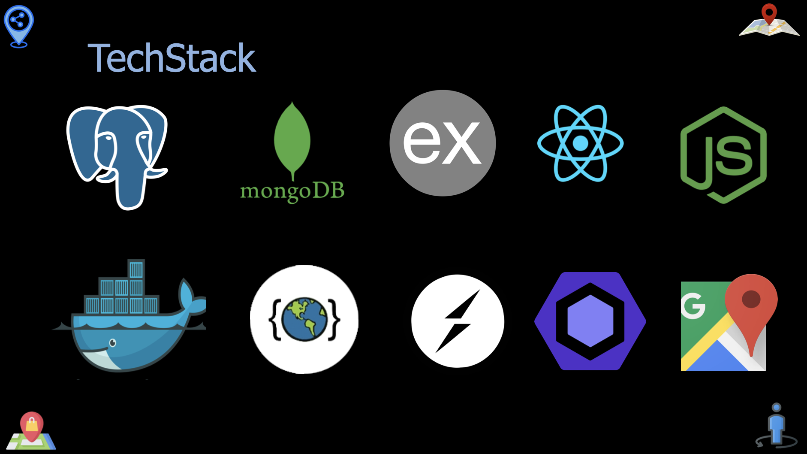 -->

## Setting up locally

The codebase is organized as :

1. _ts-frontend_ - The react frontend
2. _backend/ts-backend_ - The primary express backend with mongoDB
3. _backend/loc_ - The secondary express backend with Postgres
4. _backend/ws_ - The websocket backend

- Clone the PrivacyNetwork repository

```bash
    git clone git@github.com:sanam2405/PrivacyNetwork.git
    cd PrivacyNetwork
```

- Run the frontend

```bash
    cd ts-frontend
    npm install
    npm run dev
```

- Run the express backend

```bash
    cd backend/ts-backend
    npm install
    npm run dev
```

- Run the loc backend

```bash
    cd backend/loc
    npm install
    npm run dev
```

- Run the websocket backend

```bash
    cd backend/ws
    npm install
    npm run build
    npm start
```

## Contributors

- `Manas Pratim Biswas` -
  [LinkedIn](https://www.linkedin.com/in/manas-pratim-biswas/)
- `Anumoy Nandy` -
  [LinkedIn](https://www.linkedin.com/in/anumoy-nandy-9b527b204/)
- `Kunal Pramanick` -
  [LinkedIn](https://www.linkedin.com/in/kunal-pramanick-9755061b0/)

## Mentor

- `Dr. Munmun Bhattacharya`
